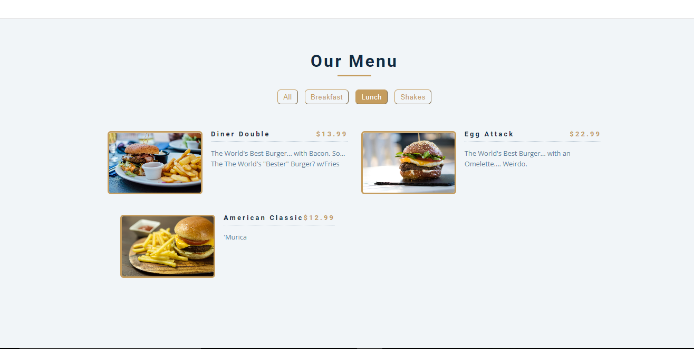
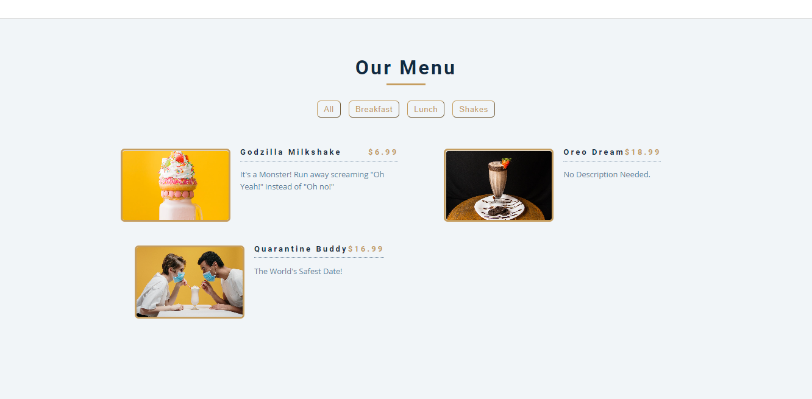

<h1>Responsive Menu Project</h1>

<h2>Description</h2>
Project consists of JavaScript, Classes, and multiple buttons that divide those Classes. The way the code was written was to reference the class in the function to keep the amount of code down, and make it easy to read. This action is also great if there was ever a new Class or item added. This was a fun project to master, as it was my first time utilizing images!
 

<h2>Languages and Utilities Used</h2>

- <b>JavaScript, CSS, HTML</b> 
- <b>GitHub, Images</b>

<h2>Environments Used </h2>

- <b>Windows 10</b> (21H2)

<h2>Program walk-through:</h2>

Home Page:  
   

 
 
Click the "Breafast" button to only see Breakfast Items.   
   

 
 
Click the "Lunch" button to only see Lunch Items  
   

 
 
  Click the "Shakes" button to only see Lunch Items  
   

 
 

